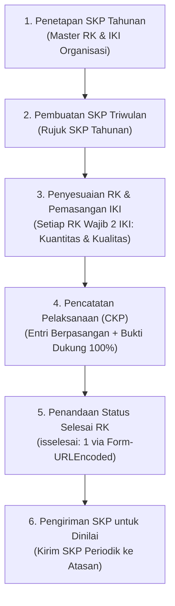

# KIPAPP BPS: Panduan Lengkap Pengelolaan SKP & Kinerja Pegawai

Skill ini memandu alur lengkap perencanaan, pelaksanaan, pemantauan, dan evaluasi kinerja ASN BPS pada aplikasi **KIPAPP BPS** (`https://kipapp.bps.go.id`) sesuai standar Permen PANRB No. 6 Tahun 2022.

---

## 1. Siklus Utama Pengelolaan SKP di KIPAPP



---

## 2. Prosedur Pembuatan SKP

### A. SKP Tahunan (Awal Tahun)
1. Dibuat pada awal tahun anggaran setelah Perjanjian Kinerja (PK) pimpinan satker ditetapkan.
2. Memuat seluruh butir Rencana Kinerja (RK) hasil *cascading* Matriks Pembagian Peran dan Hasil (MPH) tim kerja.
3. Menjadi basis rujukan (*parent*) untuk seluruh SKP periodik berikutnya.

### B. SKP Triwulanan / Periodik
1. **Aturan Ketergantungan Sekuensial:**
   SKP Triwulan sebelumnya **harus sudah dikirim untuk dinilai** (`statusskpid: 5`) sebelum SKP Triwulan berikutnya dapat dibuat/diajukan. Sistem akan menolak pembuatan SKP periode baru jika periode sebelumnya masih berstatus draf (`statusskpid: 1`).
2. **Pembuatan via API / UI:**
   - Gunakan opsi **"Rujuk SKP Tahunan"** (`isrujukskp: 1`) agar seluruh 29 RK tahunan otomatis disalin ke periode triwulan.
   - Endpoint: `POST /api/v1/skp` (Payload: `pegawaiid`, `periodeid`, `periodepenilaianid`, `jenis: 2`, `isrujukskp: 1`, `skpid: <id_tahunan>`).

---

## 3. Pengelolaan Rencana Kinerja (RK) & Aturan Baku IKI

### A. Penambahan RK Dinamis (Tugas Baru Tim Kerja)
Apabila ada kegiatan pada laporan CKP yang belum terwadahi dalam daftar RK yang disalin dari SKP Tahunan (misalnya: *Pelatihan Dasar CPNS*, *Survei Seruti*, dll.):
1. Tambahkan RK baru bertipe Tambahan (`jenis: 2`) via `POST /api/v1/skp/rk`.
2. Hubungkan dengan atasan/tim kerja yang relevan (atau mandiri).

### B. Aturan Baku Pemasangan IKI (Invarian Kritis)
> [!IMPORTANT]
> **KIPAPP mensyaratkan setiap RK wajib memiliki IKI.** Pengiriman SKP akan **GAGAL** dengan pesan error *"Gagal mengirim SKP. Terdapat rencana kinerja belum memiliki IKI."* jika ada RK yang tidak memiliki IKI.

Setiap butir RK (baik Utama maupun Tambahan) wajib dilengkapi **sepasang IKI**:
1. **IKI Kuantitas:**
   - Aspek: `Kuantitas`
   - Indikator: `Tingkat kuantitas [uraian kinerja]`
   - Target: `100`, Satuan: `persen`
2. **IKI Kualitas:**
   - Aspek: `Kualitas`
   - Indikator: `Tingkat kualitas [uraian kinerja]`
   - Target: `100`, Satuan: `persen`

Endpoint penambahan IKI: `POST /api/v1/skp/iki`.

### C. Pengelolaan RK Lintas Triwulan
Butir RK dari SKP Tahunan yang kegiatannya sudah tuntas pada triwulan sebelumnya (misalnya: *Laporan PDRB Lapangan Usaha* yang selesai di TW II) **tetap aman dibiarkan tercantum pada triwulan berikutnya (TW III)** dengan realisasi kegiatan 0. RK tersebut tetap memiliki IKI dan ditandai status selesai agar konsisten dengan evaluasi tahunan.

---

## 4. Pencatatan Pelaksanaan Kinerja (Log Kegiatan Harian / CKP)

### Standar Baku Pencatatan:
1. **Entri Berpasangan (Kuantitas & Kualitas):**
   Setiap butir kegiatan fisik dari laporan CKP dicatat menjadi **2 entri realisasi di KIPAPP**:
   - Entri 1 (Aspek Kuantitas): Capaian: `"Tingkat kuantitas [kegiatan] 100 persen"`, `progres: 100`, `capaian: 100`.
   - Entri 2 (Aspek Kualitas): Capaian: `"Tingkat kualitas [kegiatan] 100 persen"`, `progres: 100`, `capaian: 100`.
2. **Kelengkapan Bukti Dukung (*Evidence*):**
   - Setiap entri kegiatan wajib menyertakan link bukti dukung (`datadukung`) yang valid (Google Drive, Google Docs, Spreadsheet, atau produk digital).
   - Dilarang mengosongkan bukti dukung.
3. **Validasi Rentang Periode:**
   - Tanggal kegiatan harus berada di dalam batas waktu periode SKP berjalan (TW I: Jan–Mar, TW II: Apr–Jun, TW III: Jul–Sep, TW IV: Okt–Des).
4. **Pengiriman Kegiatan ke Atasan:**
   - Setelah selesai dicatat, seluruh kegiatan harus dikirim ke atasan via `POST /api/v1/kegiatan/kirim` (`{"kegiatanids": [...]}`).
   - Pastikan field `tanggalkirim` terisi.

---

## 5. Menandai Status Selesai pada Rencana Kinerja (Tandai Selesai)

Sebelum SKP Periodik dapat diajukan untuk dinilai, sistem menuntut agar status penyelesaian seluruh RK ditandai selesai.

> [!TIP]
> **Spesifikasi Teknis Endpoint "Tandai Selesai":**
> - **Method & URL:** `PUT https://kipapp.bps.go.id/api/v1/skp/rk`
> - **Header Wajib:**
>   - `Authorization`: `Bearer <JWT_TOKEN>`
>   - `Content-Type`: `application/x-www-form-urlencoded` (*wajib form-urlencoded, BUKAN json mentah*)
> - **Payload:**
>   ```
>   id=<rkid>&skpid=<skpid>&jenis=<1|2>&rencanakinerja=<teks_rk>&lingkupid=&isselesai=1
>   ```
> - Parameter kuncinya adalah **`isselesai=1`**. Backend KIPAPP akan secara otomatis mengupdate timestamp `tglselesai` dan menampilkan ikon centang hijau **"Selesai"** pada halaman [Perencanaan Rencana Kinerja](https://kipapp.bps.go.id/#/perencanaan-rencana-kinerja).

---

## 6. Checklist Pra-Pengiriman SKP Periodik

Pastikan 5 pilar berikut terpenuhi 100% sebelum menekan tombol **"Kirim SKP untuk dinilai"**:
1. [x] **SKP Triwulan Sebelumnya Telah Dinilai / Terkirim** (`statusskpid: 5`).
2. [x] **Seluruh RK Memiliki IKI** (2 IKI per RK: Kuantitas & Kualitas, 0 RK tanpa IKI).
3. [x] **Realisasi Kegiatan Berpasangan** (Kuantitas & Kualitas lengkap dengan bukti dukung valid).
4. [x] **Seluruh Kegiatan Telah Dikirim ke Atasan** (`tanggalkirim` terisi lengkap).
5. [x] **Seluruh RK Ditandai Selesai** (`isselesai: 1` / `tglselesai` terisi lengkap).

Setelah checklist terpenuhi:
1. Buka menu **SKP Periodik / Perencanaan Bulanan** (`#/perencanaan-bulanan`).
2. Temukan baris triwulan bersangkutan.
3. Klik tombol **Aksi > Kirim SKP untuk dinilai**.

---

## Berkas Referensi & Skrip Otomatisasi
- [Referensi REST API Lengkap](./references/api_reference.md)
- [Panduan Siklus & Alur Kerja Bisnis](./references/workflow_guide.md)
- [Pedoman Substantif Pengelolaan Kinerja ASN (Permen PANRB 6/2022)](../kinerja-asn-permenpan6/SKILL.md)
- [Skrip Batch Tandai Selesai](./scripts/mark_selesai.py)
- [Skrip Verifikasi Kesiapan SKP](./scripts/verify_skp.py)
