# Arsitektur Skema Database Multiakun SuperBrain BPS

Dokumen ini mendefinisikan struktur data, skema database Firestore, aturan keamanan, serta strategi partisi data multi-tenant / multi-akun pada aplikasi **SuperBrain BPS**.

---

## 1. Prinsip dan Strategi Isolasi Multi-Tenant

SuperBrain BPS mengimplementasikan model **Partitioned Shared-Database Multi-Tenancy**. Seluruh entitas data operasional pegawai disimpan pada koleksi bersama namun diisolasi secara mutlak menggunakan kunci partisi `userId` (`request.auth.uid`).

### Karakteristik Utama Arsitektur:
1. **Partition Key Wajib**: Setiap dokumen operasional (`ckp`, `schedule`, `tasks`, `skps`, `teams`, `projects`, `holidays`, `dinas_lapangan`, `training_programs`, `short_links`) wajib memiliki atribut `userId` bertipe `string` yang merefleksikan UID Firebase Authentication pengguna.
2. **Koleksi Profil Mandiri (`users/{userId}`)**: Dokumen profil utama disimpan pada path dokumen deterministik `/users/{userId}`, di mana ID dokumen identik dengan UID pengguna.
3. **Isolasi Query di Level Klien**: Seluruh pembacaan data (`onSnapshot` / `getDocs`) selalu dieksekusi dengan predikat filter `where('userId', '==', user.uid)`.
4. **Enforcement di Level Firestore Security Rules**: Akses baca, tulis, perbarui, dan hapus diverifikasi secara independen oleh mesin keamanan Firestore di tingkat peladen (*server-side*). Dokumen yang tidak memiliki kecocokan `request.auth.uid == resource.data.userId` akan otomatis ditolak dengan galat `permission-denied`.
5. **Dukungan Kueri Komposit & Pengurutan**: Disediakan `firestore.indexes.json` yang mendefinisikan composite indexes untuk kombinasi filter `userId` dan pengurutan kronologis (`tanggal`, `createdAt`).

---

## 2. Diagram Relasi Entitas (ERD)

```mermaid
erDiagram
    USERS ||--o{ CKP : "mencatat"
    USERS ||--o{ SCHEDULE : "menjadwalkan"
    USERS ||--o{ TASKS : "mengelola"
    USERS ||--o{ SKPS : "memiliki"
    USERS ||--o{ TEAMS : "membentuk"
    USERS ||--o{ PROJECTS : "memiliki"
    USERS ||--o{ HOLIDAYS : "menandai"
    USERS ||--o{ DINAS_LAPANGAN : "menandai"
    USERS ||--o{ TRAINING_PROGRAMS : "mengikuti"
    USERS ||--o{ SHORT_LINKS : "membuat"
    USERS ||--o| BACKUPS : "mencadangkan"
    USERS ||--o| TELEGRAM_MAPPINGS : "menghubungkan"

    USERS {
        string uid PK "Document ID = auth.uid"
        string email
        string displayName
        string photoURL
        string nip "18 digit NIP BPS"
        string jabatan "Jabatan fungsional"
        string satker "Satuan kerja"
        string timKerjaDefault
        array customSatuan "Daftar satuan kustom"
        array activityPresets "Daftar preset kegiatan"
        map preferences "Preferensi UI dan kompresi"
        timestamp createdAt
        timestamp updatedAt
        timestamp lastLoginAt
    }

    CKP {
        string id PK "Auto ID"
        string userId FK "Kunci partisi kepemilikan"
        string tanggal "YYYY-MM-DD"
        string waktuMulai "HH:MM"
        string waktuSelesai "HH:MM"
        number durasi "Menit"
        string skpId "ID referensi SKP"
        array skpIds "Multi-SKP tagging"
        string rincian "Uraian kegiatan harian"
        number kuantitas
        string satuan
        string timKerja
        number kualitas "Nilai mutu default 100"
        string buktiDukung "URL Google Drive / Shortlink"
        array buktiDukungFiles "Multifile lampiran"
        string sourceScheduleId FK "Relasi ke agenda jadwal"
        string sourceTaskId FK "Relasi ke tugas kanban"
        string groupId "ID pengelompokan kegiatan multihari"
        timestamp createdAt
        timestamp updatedAt
    }

    SCHEDULE {
        string id PK "Auto ID"
        string userId FK "Kunci partisi kepemilikan"
        string judul "Nama kegiatan"
        string deskripsi
        string tanggal "YYYY-MM-DD"
        string waktu "HH:MM"
        string kategori "Rapat, Pelatihan, Lapangan, dll"
        string lokasi
        array reminders "Daftar pengingat waktu"
        array sentReminders "Riwayat pengingat terkirim"
        boolean isSelesai "Status penyelesaian"
        array attachments "Berkas lampiran Drive"
        array linkedTaskIds "Relasi ke tugas"
        string gcalEventId "ID sinkronisasi Google Calendar"
        timestamp createdAt
        timestamp updatedAt
    }

    TASKS {
        string id PK "Auto ID"
        string userId FK "Kunci partisi kepemilikan"
        string judul
        string deskripsi
        string status "todo, in_progress, done"
        string skpId FK
        string peran "Ketua Tim, Anggota, Admin"
        string urgensi "Rendah, Sedang, Tinggi"
        string deadline "YYYY-MM-DD"
        array checklist "Subtugas bertahap"
        array attachments
        string linkedScheduleId FK
        timestamp createdAt
        timestamp updatedAt
    }

    SKPS {
        string id PK "Auto ID"
        string userId FK "Kunci partisi kepemilikan"
        string nama "Rencana Hasil Kerja"
        string tim "Tim kerja pengampu"
        string cluster "Proyek kegiatan"
        string kategori "utama / tambahan"
        number targetQty "Target kuantitas tahunan"
        number targetQly "Target kualitas (100)"
        string satuan
        timestamp createdAt
        timestamp updatedAt
    }

    TEAMS {
        string id PK "Auto ID"
        string userId FK "Kunci partisi kepemilikan"
        string nama "Nama tim kerja"
        timestamp createdAt
    }

    PROJECTS {
        string id PK "Auto ID"
        string userId FK "Kunci partisi kepemilikan"
        string nama "Nama klaster/proyek"
        string timNama "Nama tim kerja terkait"
        timestamp createdAt
    }

    HOLIDAYS {
        string id PK "Auto ID"
        string userId FK "Kunci partisi kepemilikan"
        string tanggal "YYYY-MM-DD"
        string keterangan
        timestamp createdAt
    }

    DINAS_LAPANGAN {
        string id PK "Auto ID"
        string userId FK "Kunci partisi kepemilikan"
        string tanggal "YYYY-MM-DD"
        string keterangan
        timestamp createdAt
    }

    TRAINING_PROGRAMS {
        string id PK "Auto ID"
        string userId FK "Kunci partisi kepemilikan"
        string judul
        string penyelenggara
        string tanggalMulai
        string tanggalSelesai
        number jamPelajaran
        string status "rencana, berlangsung, selesai"
        timestamp createdAt
    }

    TELEGRAM_MAPPINGS {
        string chatId PK "ID Chat Telegram"
        string userId FK "UID pemilik akun"
        timestamp updatedAt
    }

    SHORT_LINKS {
        string id PK "Auto ID"
        string slug UK "Slug unik global"
        string longUrl "URL tujuan"
        number clicks "Jumlah klik"
        string userId FK "UID pemilik tautan"
        timestamp createdAt
    }

    BACKUPS {
        string userId PK "Document ID = auth.uid"
        string payload "Snapshot JSON terenkapsulasi"
        timestamp timestamp
    }
```

---

## 3. Spesifikasi Skema Detail Koleksi

### 3.1. Koleksi `users`
- **Path**: `/users/{userId}`
- **Fungsi**: Menyimpan profil resmi pegawai BPS, identitas kerja, preferensi aplikasi, satuan kustom, dan preset kegiatan yang tersinkronisasi lintas perangkat.
- **Kunci Dokumen**: `userId` (UID dari Firebase Auth).
- **Atribut**:
  | Atribut | Tipe | Wajib | Keterangan |
  | :--- | :--- | :---: | :--- |
  | `uid` | string | Ya | Identik dengan Document ID |
  | `email` | string | Ya | Email akun Google / BPS |
  | `displayName` | string | Ya | Nama lengkap pengguna |
  | `photoURL` | string | Tidak | URL avatar profil Google |
  | `nip` | string | Tidak | NIP BPS 18 digit |
  | `jabatan` | string | Tidak | Jabatan fungsional (misal: Statistisi Ahli Pertama) |
  | `satker` | string | Tidak | Satuan kerja (misal: BPS Kab. Penajam Paser Utara) |
  | `timKerjaDefault` | string | Tidak | Tim kerja default pada form entri kegiatan |
  | `customSatuan` | array<string> | Tidak | Daftar satuan kuantitas kustom pengguna |
  | `activityPresets` | array<object> | Tidak | Daftar template kegiatan favorit |
  | `preferences` | map | Tidak | Konfigurasi tema, kompresi otomatis, dll |
  | `createdAt` | timestamp | Ya | Waktu registrasi awal |
  | `updatedAt` | timestamp | Ya | Waktu modifikasi terakhir |
  | `lastLoginAt` | timestamp | Ya | Waktu autentikasi terakhir |

### 3.2. Koleksi `ckp` (Capaian Kinerja Pegawai)
- **Path**: `/ckp/{docId}`
- **Fungsi**: Menyimpan laporan capaian kinerja harian pegawai BPS.
- **Atribut**:
  | Atribut | Tipe | Wajib | Keterangan |
  | :--- | :--- | :---: | :--- |
  | `userId` | string | Ya | Kunci isolasi akun |
  | `tanggal` | string | Ya | Format ISO `YYYY-MM-DD` |
  | `waktuMulai` | string | Ya | Format `HH:MM` |
  | `waktuSelesai` | string | Ya | Format `HH:MM` |
  | `durasi` | number | Ya | Durasi kegiatan dalam satuan menit |
  | `rincian` | string | Ya | Uraian deskripsi kegiatan |
  | `kuantitas` | number | Ya | Jumlah volume output |
  | `satuan` | string | Ya | Satuan volume (Kegiatan, Dokumen, dll) |
  | `kualitas` | number | Ya | Persentase kualitas (default 100) |
  | `skpId` | string/number | Tidak | Referensi ID Rencana Kinerja SKP |
  | `skpIds` | array<number> | Tidak | Multi-tagging beberapa SKP jika berlaku |
  | `timKerja` | string | Ya | Tim kerja pengampu kegiatan |
  | `buktiDukung` | string | Tidak | Tautan Google Drive atau link ringkas bukti kerja |
  | `buktiDukungFiles`| array<map> | Tidak | Daftar nama dan tautan berkas pendukung |
  | `sourceScheduleId`| string | Tidak | Referensi ID agenda asal jika dibuat dari jadwal |
  | `sourceTaskId` | string | Tidak | Referensi ID tugas asal jika dibuat dari papan kanban |
  | `groupId` | string | Tidak | Pengelompokan pengulangan kegiatan lintas tanggal |
  | `createdAt` | timestamp | Ya | Timestamp peladen |
  | `updatedAt` | timestamp | Tidak | Timestamp pembaruan |

### 3.3. Koleksi `schedule` (Agenda Kegiatan)
- **Path**: `/schedule/{docId}`
- **Fungsi**: Mencatat agenda rapat, dinas luar, survei, pelatihan, dan kegiatan terjadwal.
- **Atribut**:
  | Atribut | Tipe | Wajib | Keterangan |
  | :--- | :--- | :---: | :--- |
  | `userId` | string | Ya | Kunci isolasi akun |
  | `judul` | string | Ya | Nama agenda |
  | `deskripsi` | string | Tidak | Rincian agenda |
  | `tanggal` | string | Ya | Format `YYYY-MM-DD` |
  | `waktu` | string | Ya | Format `HH:MM` |
  | `kategori` | string | Ya | Kategori agenda |
  | `lokasi` | string | Tidak | Tempat rapat / lokasi tugas |
  | `reminders` | array<string> | Tidak | Pengingat aktif (misal: "1 Jam Sebelum") |
  | `sentReminders` | array<string> | Tidak | Pencatat status pengingat yang telah dikirim |
  | `isSelesai` | boolean | Ya | Flag penanda selesai |
  | `attachments` | array<map> | Tidak | Berkas surat tugas / undangan di Google Drive |
  | `linkedTaskIds` | array<string> | Tidak | Relasi dua arah ke tugas kanban |
  | `gcalEventId` | string | Tidak | ID sinkronisasi event Google Calendar |
  | `createdAt` | timestamp | Ya | Timestamp peladen |

### 3.4. Koleksi `tasks` (Papan Kerja Kanban)
- **Path**: `/tasks/{docId}`
- **Fungsi**: Manajemen tugas, checklist tahapan kerja, dan pelacakan target kerja tim.
- **Atribut**:
  | Atribut | Tipe | Wajib | Keterangan |
  | :--- | :--- | :---: | :--- |
  | `userId` | string | Ya | Kunci isolasi akun |
  | `judul` | string | Ya | Judul tugas |
  | `deskripsi` | string | Tidak | Penjelasan rincian tugas |
  | `status` | string | Ya | Status: `todo`, `in_progress`, `done` |
  | `skpId` | string/number | Tidak | Referensi ke butir SKP |
  | `peran` | string | Ya | Peran dalam tugas (Ketua Tim, Anggota, Admin) |
  | `urgensi` | string | Ya | Tingkat urgensi: Rendah, Sedang, Tinggi |
  | `deadline` | string | Tidak | Batas waktu penyelesaian `YYYY-MM-DD` |
  | `checklist` | array<map> | Tidak | Daftar subtugas `{ id, text, completed }` |
  | `attachments` | array<map> | Tidak | Berkas lampiran hasil kerja |
  | `linkedScheduleId`| string | Tidak | Relasi ke agenda jadwal terkait |
  | `createdAt` | timestamp | Ya | Timestamp peladen |

### 3.5. Koleksi `skps`, `teams`, dan `projects`
- **Fungsi**: Mengelola matriks peran hasil (MPH), daftar tim kerja satuan kerja, proyek kegiatan, dan butir rencana kinerja SKP tahunan per akun pegawai.
- **Isolasi**: Seluruh dokumen memiliki `userId` mandiri, sehingga penambahan atau modifikasi SKP oleh Akun A tidak akan mempengaruhi daftar SKP Akun B.

---

## 4. Keamanan dan Verifikasi Rules (`firestore.rules`)

Aturan keamanan Firestore dikonfigurasi secara eksplisit tanpa menggunakan fallback wildcard yang berisiko membocorkan data antar akun:

1. **Aturan Koleksi `users/{userId}`**:
   Hanya akun pemilik UID yang dapat membaca dan memperbarui dokumen profilnya sendiri.
2. **Aturan Mutasi Koleksi Operasional**:
   - `create`: Wajib `request.auth.uid == request.resource.data.userId`.
   - `read`: Wajib `request.auth.uid == resource.data.userId`.
   - `update`: Wajib mempertahankan `request.resource.data.userId == request.auth.uid`.
   - `delete`: Wajib `request.auth.uid == resource.data.userId`.
3. **Pengecualian Terkendali**:
   - `short_links`: Membuka hak akses baca publik (`allow read: if true`) untuk mendukung resolusi link pengalihan `/s/[slug]`, namun pembuatan dan penghapusan tetap terikat ke `userId`.

---

## 5. Indeks Komposit Multi-Tenant (`firestore.indexes.json`)

Untuk mendukung kinerja kueri yang optimal tanpa menimbulkan overhead latensi, indeks komposit berikut diterapkan:

| Koleksi | Field 1 | Field 2 | Kegunaan |
| :--- | :--- | :--- | :--- |
| `ckp` | `userId` (ASC) | `tanggal` (DESC) | Rekapitulasi bulanan & harian terurut |
| `ckp` | `userId` (ASC) | `createdAt` (DESC) | Riwayat pencatatan kegiatan terbaru |
| `schedule` | `userId` (ASC) | `tanggal` (ASC) | Tampilan kalender agenda mendatang |
| `schedule` | `userId` (ASC) | `createdAt` (DESC) | Riwayat pembuatan agenda |
| `tasks` | `userId` (ASC) | `status` (ASC) | Filter status papan Kanban per kolom |
| `tasks` | `userId` (ASC) | `createdAt` (DESC) | Pengurutan kartu tugas |
| `training_programs` | `userId` (ASC) | `createdAt` (DESC) | Riwayat pelatihan pegawai |
| `short_links` | `userId` (ASC) | `createdAt` (DESC) | Daftar tautan singkat milik pengguna |

---

## 6. Sinkronisasi Offline & Cache Lintas Perangkat

1. **IndexedDB Scope**: Antrean penyimpanan berkas offline (`pending_uploads`) dan draf kegiatan (`draft_activities`) diikat dengan parameter `userId`.
2. **Local Cache Invalidation**: Saat pengguna melakukan pergantian akun atau keluar (*logout*), antrean undo/redo dibersihkan, memori state dikosongkan, dan token Google Drive per-akun dihapus secara aman.
3. **Cloud Hydration**: Preferensi kustom seperti `customSatuan` dan `activityPresets` disimpan di dokumen Firestore `/users/{userId}`, sehingga saat pegawai berganti laptop atau masuk melalui peramban ponsel, data preferensi langsung tersedia secara utuh.
